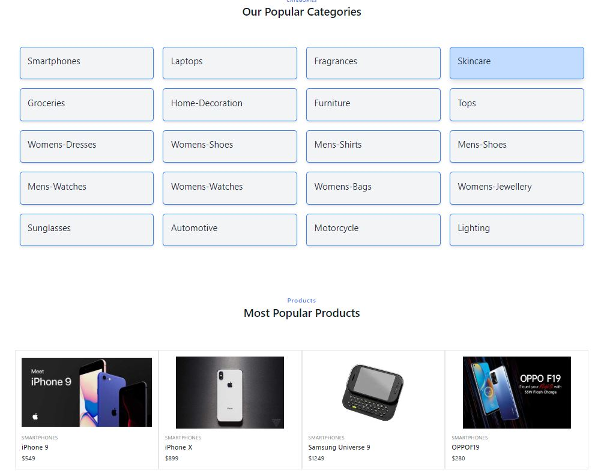

## 🛍️Single-Page E-commerce Site Development using React Js 

  

## Basic Overview

This simple shopping cart prototype shows how React with Typescript, React hooks, react Context and Styled Components can be used to build a friendly user experience with instant visual updates and scaleable code in ecommerce applications.

#### Features

- Add and remove products from the floating cart using Context Api
- Filter products by available sizes using Context Api
- Responsive design

<!--
## Getting started

Try playing with the code on CodeSandbox :)

 -->

## Build/Run

#### Requirements

- Node.js
- NPM

