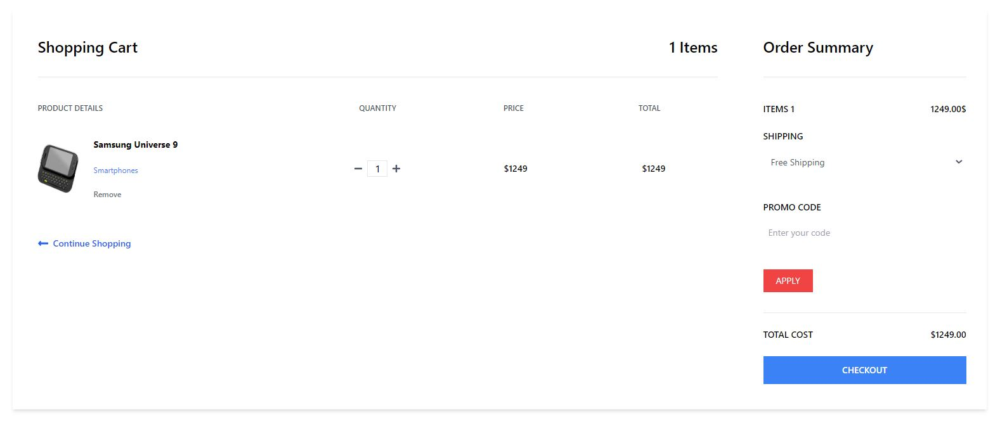

## 🛍️Single-Page E-commerce Site Development using React Js 

Website Link - <a>https://amindubhashana.github.io/E_Shop/</a>

## Table of Contents

- [Features](#features)
- [Usage](#usage)
- [Technologies Used](#technologies-used)
- [Overview](#overview)

## Features

- Display a list of products with pagination.
- Filter products by categories.
- Search for products using keywords.
- Add to Cart Option
- User-friendly interface with responsive design.

## Usage
- Browse the list of products on the homepage.
- Use the brand filter to narrow down products by brand.
- Enter a search query and click the "Search" button to find products.
- Navigate through pages using pagination buttons.

## Technologies Used
- React
- Tailwind CSS
- JavaScript

## Overview

    
   

